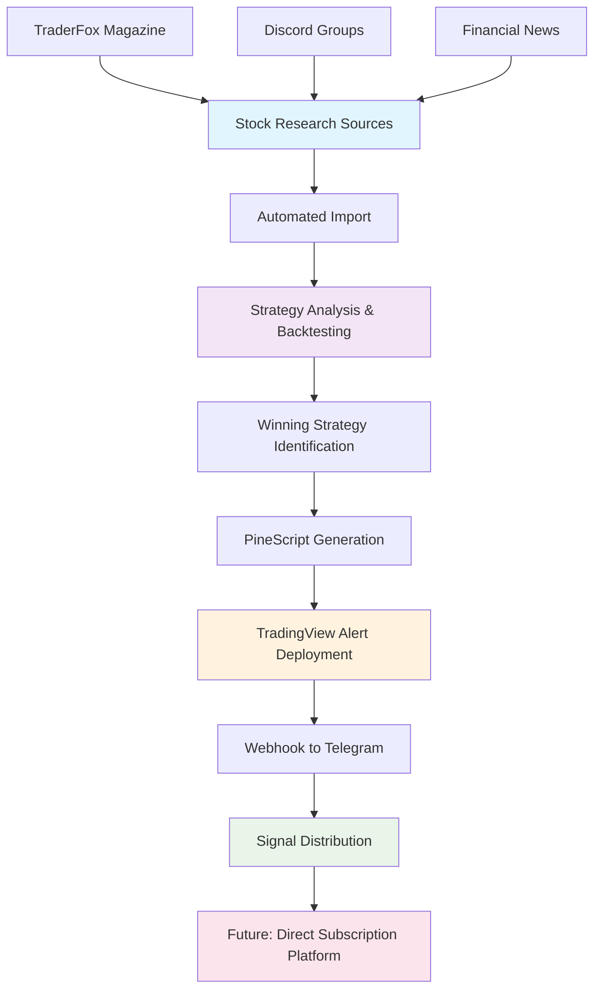

# Future Features Roadmap

Automated stock research and signal generation pipeline: **Research → Import → Analyze/Backtest → TradingView Signals → Telegram → Subscription Platform**

> **Main Goal**: Automate the complete workflow from stock discovery (TraderFox, Discord) through backtesting to TradingView signal delivery in Telegram, eventually replacing TradingView with a direct subscription platform.

## 📈 Core Workflow Pipeline



## 🎯 Critical Priority Features

### 1. QuantConnect Portfolio Builder & Export (Immediate Priority)
**Status**: Immediate Priority
**Description**: Automated creation of optimized QuantConnect portfolios with strategy grouping and export to quant-portfolios repository.

**Features**:
- **Strategy Grouping Analysis**:
  - Analyze backtest/optimization results to identify assets with matching strategies
  - Group assets by identical strategy name and timeframe combinations
  - Validate portfolio composition (maximum 5 strategies per portfolio)
  - Asset correlation analysis within strategy groups
- **Portfolio Optimization**:
  - Risk-balanced asset allocation within strategy groups
  - Maximum drawdown and volatility constraints
  - Capital allocation optimization across strategies
  - Portfolio diversification scoring and validation
- **QuantConnect Export System**:
  - Generate QuantConnect-compatible portfolio configurations
  - Export to quant-portfolios repository as new branch
  - Automated git branch creation and commit with portfolio metadata
  - Portfolio performance tracking and comparison framework

**Implementation**:
```python
# QuantConnect portfolio builder and exporter
class QuantConnectPortfolioBuilder:
    def __init__(self):
        self.portfolio_analyzer = PortfolioAnalyzer()
        self.strategy_grouper = StrategyGrouper()
        self.qc_exporter = QuantConnectExporter()
        self.git_manager = GitManager()

    def build_optimized_portfolios(self, backtest_results):
        # 1. Group assets by strategy and timeframe
        strategy_groups = self.strategy_grouper.group_by_strategy_timeframe(backtest_results)

        # 2. Create portfolios with max 5 strategies each
        portfolios = []
        for group_name, assets in strategy_groups.items():
            if len(assets) >= 3:  # Minimum assets for diversification
                portfolio = self.create_portfolio(group_name, assets[:20])  # Max 20 assets
                portfolios.append(portfolio)

        return portfolios

    def create_portfolio(self, strategy_group, assets):
        # Optimize asset weights within strategy group
        optimized_weights = self.portfolio_analyzer.optimize_weights(
            assets,
            max_weight=0.15,  # Max 15% per asset
            min_correlation=0.3  # Diversification threshold
        )

        return {
            "name": f"QC_Portfolio_{strategy_group}",
            "strategy_group": strategy_group,
            "assets": assets,
            "weights": optimized_weights,
            "expected_sharpe": self.calculate_portfolio_sharpe(assets, optimized_weights),
            "max_drawdown": self.calculate_max_drawdown(assets, optimized_weights)
        }

    async def export_to_quant_portfolios_repo(self, portfolios):
        # Create new branch for portfolio batch
        branch_name = f"portfolios_{datetime.now().strftime('%Y%m%d_%H%M%S')}"

        for portfolio in portfolios:
            # Generate QuantConnect configuration
            qc_config = self.qc_exporter.generate_config(portfolio)

            # Export to quant-portfolios repo
            await self.git_manager.create_branch_and_commit(
                repo="quant-portfolios",
                branch=branch_name,
                portfolio_config=qc_config,
                portfolio_name=portfolio["name"]
            )

        return branch_name
```

**Portfolio Grouping Logic**:
```python
# Strategy grouping for portfolio creation
class StrategyGrouper:
    def group_by_strategy_timeframe(self, backtest_results):
        strategy_groups = {}

        for asset, strategies in backtest_results.items():
            best_strategy = max(strategies, key=lambda x: x.sharpe_ratio)

            # Create group key from strategy name and timeframe
            group_key = f"{best_strategy.name}_{best_strategy.timeframe}"

            if group_key not in strategy_groups:
                strategy_groups[group_key] = []

            strategy_groups[group_key].append({
                "symbol": asset,
                "strategy": best_strategy,
                "sharpe_ratio": best_strategy.sharpe_ratio,
                "max_drawdown": best_strategy.max_drawdown
            })

        # Filter groups with minimum viable portfolio size
        return {k: v for k, v in strategy_groups.items() if len(v) >= 3}
```

### 2. TradingView-Telegram Bridge (Short-term Solution)
**Status**: Immediate Priority
**Description**: Export winning strategies as PineScript with TradingView alerts routed to Telegram via webhooks.

**Features**:
- **Strategy Export Engine**:
  - Analyze portfolio reports to identify winning strategies per asset
  - Import related PineScript from strategies repository
  - Adjust strategy parameters found in backtest/optimization results
  - Asset-specific parameter optimization and fine-tuning
- **TradingView Integration**:
  - Automated PineScript deployment to TradingView
  - Alert configuration with webhook URLs pointing to Telegram
  - Asset-specific alert thresholds based on strategy performance
  - Alert management system (create/update/delete via TradingView API)
- **Telegram Webhook Receiver**:
  - Webhook endpoint to receive TradingView alerts
  - Alert formatting and routing to Telegram groups
  - Signal validation and duplicate filtering
  - Alert rate limiting (max 1000 parallel TradingView limit)

**Implementation**:
```python
# TradingView-Telegram bridge system
class TradingViewTelegramBridge:
    def __init__(self):
        self.strategy_exporter = StrategyExporter()
        self.pinescript_generator = PineScriptGenerator()
        self.tradingview_api = TradingViewAPI()
        self.telegram_webhook = TelegramWebhook()

    def export_winning_strategy(self, portfolio_report, asset):
        # Get best performing strategy for asset
        best_strategy = portfolio_report.get_best_strategy_for_asset(asset)

        # Import PineScript from strategies repo and adjust parameters
        pinescript_template = self.pinescript_generator.load_from_repo(best_strategy.name)
        pinescript = self.pinescript_generator.adjust_parameters(
            pinescript_template,
            best_strategy.optimized_params
        )

        # Deploy to TradingView with webhook alerts
        alert_config = {
            "webhook_url": f"https://yourserver.com/tv-webhook/{asset}",
            "message": f"{{\"action\": \"{{strategy.position_size}}\", \"symbol\": \"{asset}\", \"price\": \"{{close}}\", \"strategy\": \"{best_strategy.name}\"}}"
        }

        return self.tradingview_api.deploy_script(pinescript, alert_config)

    async def handle_tradingview_webhook(self, alert_data):
        # Process TradingView alert
        signal = self.parse_alert(alert_data)

        # Format for Telegram
        telegram_message = f"""
🎯 **{signal.action}** - {signal.symbol}
📊 Strategy: {signal.strategy}
💰 Price: ${signal.price}
⏰ {signal.timestamp}
"""

        # Send to Telegram
        await self.telegram_webhook.send_message(telegram_message)
```

**Alert Management**:
```python
# TradingView alert quota management (1000 limit)
class AlertQuotaManager:
    def __init__(self, max_alerts=1000):
        self.max_alerts = max_alerts
        self.active_alerts = {}

    def can_create_alert(self):
        return len(self.active_alerts) < self.max_alerts

    def prioritize_assets(self, portfolio_reports):
        # Prioritize assets by strategy performance
        return sorted(portfolio_reports.assets,
                     key=lambda x: x.best_strategy.sharpe_ratio,
                     reverse=True)[:self.max_alerts]
```

### 2. Telegram Bot Integration & Signal Distribution
**Status**: Immediate Priority
**Description**: Core Telegram bot for automated signal distribution with subscription management.

**Features**:
- **Telegram Bot Core**:
  - Multi-channel signal distribution (free/premium groups)
  - Rich signal formatting with charts and analytics
  - Interactive user commands (/subscribe, /status, /portfolio)
  - Real-time signal delivery with minimal latency
- **Signal Types**:
  - Single asset signals (BUY/SELL with entry/exit points)
  - Portfolio rebalancing signals (allocation changes)
  - Risk alerts (stop-loss, take-profit triggers)
  - Market analysis summaries

**Implementation**:
```python
# Telegram signal formatter
class TelegramSignalFormatter:
    def format_single_asset_signal(self, signal):
        return f"""
🎯 **{signal.action}** Signal - {signal.symbol}
📊 Strategy: {signal.strategy_name}
💰 Entry: ${signal.entry_price:.2f}
🎯 Target: ${signal.target_price:.2f} (+{signal.profit_pct:.1f}%)
🛡️ Stop Loss: ${signal.stop_loss:.2f} (-{signal.risk_pct:.1f}%)
📈 Confidence: {signal.confidence_score}/10
⏰ Valid until: {signal.expiry_time}
"""

    def format_portfolio_signal(self, portfolio_signal):
        allocations = "\n".join([f"• {asset}: {pct:.1f}%"
                                for asset, pct in portfolio_signal.allocations.items()])
        return f"""
📊 **Portfolio Rebalancing** - {portfolio_signal.name}
🔄 Strategy: {portfolio_signal.strategy}
📈 Expected Return: {portfolio_signal.expected_return:.1f}%
⚖️ New Allocations:
{allocations}
"""
```

### 2. Subscription Management System
**Status**: High Priority
**Description**: Complete subscription lifecycle management for free and premium tiers.

**Features**:
- **User Management**:
  - Telegram user authentication and registration
  - Subscription tier tracking (Free/Premium/VIP)
  - Payment integration (Stripe, PayPal, crypto)
  - Trial period management (7-day premium trial)
- **Access Control**:
  - Group-based access (free signals vs premium signals)
  - Signal frequency limits per tier
  - Feature gating (basic vs advanced analytics)
  - Automatic subscription renewal and expiry handling

**Subscription Tiers**:
```python
# Subscription tier configuration
SUBSCRIPTION_TIERS = {
    "free": {
        "signals_per_day": 3,
        "portfolios": ["conservative"],
        "features": ["basic_signals"],
        "price": 0
    },
    "premium": {
        "signals_per_day": 15,
        "portfolios": ["conservative", "balanced", "aggressive"],
        "features": ["advanced_signals", "portfolio_alerts", "risk_analysis"],
        "price": 29.99  # monthly
    },
    "vip": {
        "signals_per_day": "unlimited",
        "portfolios": "all",
        "features": ["all", "custom_strategies", "direct_support"],
        "price": 99.99  # monthly
    }
}
```

### 3. Signal Quality Engine
**Status**: High Priority
**Description**: Automated signal generation and quality scoring system.

**Features**:
- **Signal Generation**:
  - Real-time market scanning for opportunities
  - Multi-strategy signal validation and ranking
  - Risk-adjusted signal scoring (Sharpe ratio, win rate)
  - Signal conflict resolution (multiple strategies on same asset)
- **Quality Control**:
  - Historical performance tracking per signal type
  - Signal success rate monitoring and feedback loop
  - Automatic strategy weight adjustment based on performance
  - Signal expiry and invalidation management

### 4. Performance Tracking & Analytics
**Status**: High Priority
**Description**: Comprehensive signal performance tracking and user analytics.

**Features**:
- **Signal Performance Metrics**:
  - Real-time P&L tracking per signal
  - Win rate and average return analysis
  - Risk-adjusted performance metrics (Sharpe, Sortino ratios)
  - Signal accuracy scoring and leaderboards
- **User Analytics**:
  - Subscription engagement metrics
  - Signal follow-through rates
  - Individual user performance tracking
  - Churn prediction and retention analysis

## 🔍 High Priority Features

### 5. Automated Stock Research & Import Pipeline
**Status**: High Priority
**Description**: Complete automation of stock discovery, import, and backtesting workflow.

**Features**:
- **Research Source Automation**:
  - TraderFox magazine PDF parsing for stock picks
  - Discord group monitoring for trending mentions
  - Financial news sentiment analysis
  - Analyst rating aggregation from multiple sources
- **Automated Import & Analysis**:
  - Stock symbol validation and data fetching
  - Automated portfolio creation with discovered stocks
  - Batch backtesting using all strategies from quant-strategies repo
  - Performance ranking and winning strategy identification
- **Quality Filtering**:
  - Minimum liquidity and market cap requirements
  - Strategy performance thresholds (Sharpe ratio > 1.0)
  - Risk-adjusted return validation
  - Signal confidence scoring based on backtest results

**Implementation**:
```python
# Complete research-to-signal automation pipeline
class ResearchToSignalPipeline:
    def __init__(self):
        self.research_engine = StockResearchEngine()
        self.portfolio_manager = PortfolioManager()
        self.backtesting_engine = BacktestingEngine()
        self.signal_generator = SignalGenerator()
        self.tradingview_bridge = TradingViewBridge()

    async def run_complete_pipeline(self):
        # 1. Discover stocks from research sources
        discovered_stocks = await self.research_engine.discover_stocks()

        # 2. Import and validate stocks
        validated_stocks = self.portfolio_manager.validate_stocks(discovered_stocks)

        # 3. Create portfolios and run backtests
        portfolios = self.portfolio_manager.create_portfolios(validated_stocks)
        backtest_results = await self.backtesting_engine.run_batch_backtests(portfolios)

        # 4. Identify winning strategies per asset
        winning_strategies = self.analyze_winners(backtest_results)

        # 5. Import PineScript templates and adjust parameters
        for asset, strategy in winning_strategies.items():
            pinescript_template = self.signal_generator.load_pinescript_from_repo(strategy.name)
            pinescript = self.signal_generator.adjust_strategy_parameters(
                pinescript_template, strategy.optimized_params
            )
            await self.tradingview_bridge.deploy_with_alerts(pinescript, asset)

        return winning_strategies

    def analyze_winners(self, backtest_results):
        winners = {}
        for asset, results in backtest_results.items():
            # Find best strategy by Sharpe ratio
            best_strategy = max(results, key=lambda x: x.sharpe_ratio)
            if best_strategy.sharpe_ratio > 1.0:  # Quality threshold
                winners[asset] = best_strategy
        return winners
```

## 🔧 Medium Priority Features

### 6. Real-time Data Pipeline
**Status**: Medium Priority
**Description**: Live data processing for real-time signal generation.

**Features**:
- WebSocket connections to multiple data providers
- Real-time market data validation and processing
- Live portfolio performance tracking
- Market event detection and automated alerts

### 7. Advanced Analytics Dashboard
**Status**: Medium Priority
**Description**: Web-based interface for signal performance and user analytics.

**Features**:
- Signal performance leaderboards
- User engagement analytics
- Portfolio performance visualization
- Risk analysis and stress testing tools

## 🚀 Future Enhancements

### 8. API & Integration Platform
**Status**: Future Consideration
**Description**: External API for third-party integrations.

**Features**:
- RESTful API for signal data
- Webhook system for real-time notifications
- Third-party broker integrations
- Custom strategy plugin system

### 9. Advanced Signal Intelligence
**Status**: Future Consideration
**Description**: AI-powered signal optimization and validation.

**Features**:
- Machine learning signal quality scoring
- Automated strategy performance analysis
- Signal correlation detection and optimization
- Market regime recognition for strategy selection

## 🎯 Success Metrics

### Signal Performance
- **Signal accuracy**: >70% win rate for premium signals
- **Response time**: <30 seconds from market event to Telegram delivery
- **User engagement**: >80% signal follow-through rate
- **Subscription retention**: >90% monthly retention for premium users

### Platform Reliability
- **Uptime**: 99.9% Telegram bot availability
- **Data quality**: >95% accuracy across all data sources
- **Signal delivery**: 99.5% successful Telegram notifications
- **Processing speed**: <5 seconds for signal generation

## 🔧 Technical Architecture

### Telegram Signal Distribution
```python
# Core telegram signal system
class TelegramSignalService:
    def __init__(self):
        self.bot = TelegramBot()
        self.subscription_manager = SubscriptionManager()
        self.signal_formatter = SignalFormatter()
        self.performance_tracker = PerformanceTracker()

    async def distribute_signal(self, signal):
        # Format signal for telegram
        formatted_signal = self.signal_formatter.format(signal)

        # Get subscribers by tier
        free_users = self.subscription_manager.get_free_users()
        premium_users = self.subscription_manager.get_premium_users()

        # Send to appropriate groups
        if signal.tier == "free":
            await self.bot.send_to_group(free_users, formatted_signal)
        elif signal.tier == "premium":
            await self.bot.send_to_group(premium_users, formatted_signal)
```

### Stock Discovery Pipeline
```python
# Automated stock discovery from research sources
class StockDiscoveryPipeline:
    def __init__(self):
        self.traderfox_monitor = TraderFoxMonitor()
        self.discord_listener = DiscordListener()
        self.analyzer = StockAnalyzer()

    async def run_discovery(self):
        # Monitor TraderFox publications
        tf_stocks = await self.traderfox_monitor.get_latest_picks()

        # Monitor Discord mentions
        discord_buzz = await self.discord_listener.get_trending_mentions()

        # Analyze and rank discoveries
        ranked_stocks = self.analyzer.rank_opportunities(tf_stocks, discord_buzz)

        return ranked_stocks
```

## 🎯 Implementation Focus

### Phase 1: Core Telegram Service
1. **Telegram Bot Development** - Multi-group management and signal distribution
2. **Subscription System** - User tiers, payment processing, access control
3. **Signal Quality Engine** - Performance tracking and validation
4. **Performance Analytics** - Signal success tracking and user metrics

### Phase 2: Research Integration
1. **TraderFox Integration** - PDF parsing and stock extraction
2. **Discord Monitoring** - Community sentiment and stock mentions
3. **Stock Discovery Pipeline** - Automated research aggregation
4. **Real-time Data Pipeline** - Live market data and signal generation

### Phase 3: Advanced Features
1. **Advanced Analytics Dashboard** - Web interface for performance analysis
2. **API Integration Platform** - External system integrations
3. **Signal Intelligence** - AI-powered optimization and validation
